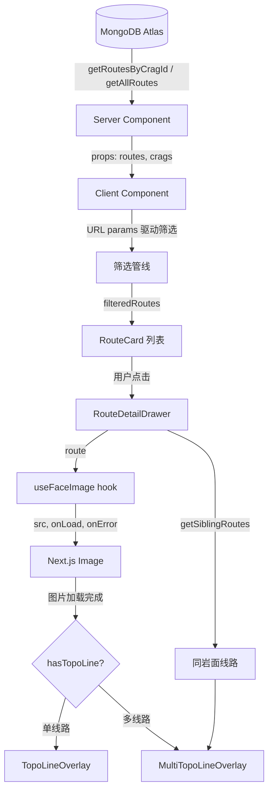
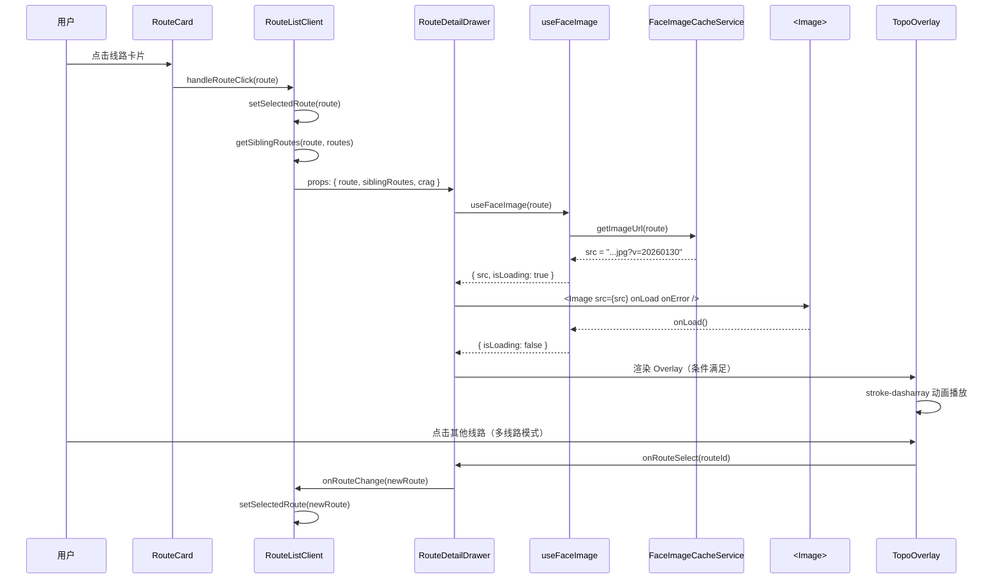

# Bloc 线路渲染数据流

> 从 MongoDB 到屏幕上的 Topo SVG 叠加，完整追踪线路数据的流转与变换。

## 总览



---

## 1. 数据源：MongoDB 访问层

**文件** `src/lib/db/index.ts`

| 函数 | 用途 | 返回值 |
|------|------|--------|
| `getRoutesByCragId(cragId)` | 获取某岩场全部线路 | `Promise<Route[]>` |
| `getAllRoutes()` | 获取所有线路（ISR 页面用） | `Promise<Route[]>` |
| `getRouteById(id)` | 获取单条线路 | `Promise<Route \| null>` |

- 所有函数使用 React `cache()` 在同一请求内去重
- MongoDB `_id` 通过 `toRoute()` 辅助函数映射为业务 `id: number`

### Route 核心字段

```typescript
// src/types/index.ts
interface Route {
  id: number          // 唯一数字 ID
  name: string        // 线路名称
  grade: string       // V0-V13 或 "？"
  cragId: string      // 所属岩场
  area: string        // 区域（如 "主岩壁"）
  faceId?: string     // 岩面 ID（同 faceId → 共享图片）
  topoLine?: TopoPoint[] // 归一化坐标 (0-1)，>=2 点才有效
  betaLinks?: BetaLink[]
  // ...其他字段省略
}
```

---

## 2. Server Component：数据加载

两个入口页面负责从 DB 取数据并透传给 Client Component。

### 岩场详情页

**文件** `src/app/[locale]/crag/[id]/page.tsx`

```
Promise.all([getCragById(id), getRoutesByCragId(id)])
  → <CragDetailClient crag={crag} routes={routes} />
```

- ISR `revalidate = 2592000`（30 天）
- `generateStaticParams()` 预生成所有岩场页面

### 线路列表页

**文件** `src/app/[locale]/route/page.tsx`

```
Promise.all([getAllRoutes(), getAllCrags()])
  → <RouteListClient routes={routes} crags={crags} />
```

---

## 3. Client Component：筛选管线

**文件** `src/app/[locale]/route/route-client.tsx`

### URL 参数驱动状态

| URL Param | 状态变量 | 类型 | 示例 |
|-----------|---------|------|------|
| `crag` | `selectedCrag` | `string` | `"yuan-tong-si"` |
| `face` | `selectedFace` | `string \| null` | `"yuan-tong-si/主岩壁/face1"` |
| `grade` | `selectedGrades` | `string[]` | `["V2","V3"]` |
| `q` | `searchQuery` | `string` | `"ywct"` |
| `sort` | `sortDirection` | `'asc' \| 'desc'` | `"asc"` |

### 筛选管线（`useMemo`）

```
routes（全量）
  ├─ 1. Crag 过滤：r.cragId === selectedCrag
  ├─ 2. Face 过滤：r.faceId || `${r.cragId}:${r.area}` === selectedFace
  ├─ 3. Grade 多选：allGrades.includes(r.grade)
  ├─ 4. 全文搜索：matchRouteByQuery(r, query) — 支持拼音首字母
  └─ 5. 排序：compareGrades() V-Scale 数值排序
  → filteredRoutes
```

**搜索引擎** `src/hooks/use-route-search.ts`

5 级优先级匹配：中文精确 > 中文子串 > 拼音全拼 > 拼音首字母 > 中文不连续

---

## 4. 用户点击线路 → RouteDetailDrawer

**文件** `src/components/route-detail-drawer.tsx`

### 入口

```typescript
// route-client.tsx 中
const handleRouteClick = (route: Route) => {
  setSelectedRoute(route)
  setIsDetailDrawerOpen(true)
}
```

### Props 接口

```typescript
interface RouteDetailDrawerProps {
  isOpen: boolean
  onClose: () => void
  route: Route | null
  siblingRoutes?: Route[]    // 同岩面线路（多线路叠加）
  crag?: Crag | null
  onRouteChange?: (route: Route) => void
}
```

### 关键派生状态

```typescript
const hasTopoLine = route?.topoLine && route.topoLine.length >= 2

const validSiblingRoutes = useMemo(() => {
  // 过滤出有 >=2 点 topoLine 的兄弟线路
  return siblingRoutes?.filter(r => r.topoLine?.length >= 2) ?? []
}, [siblingRoutes])

const hasMultiLines = validSiblingRoutes.length > 1 && hasTopoLine
const useMultiLineMode = hasMultiLines && showOtherRoutes
```

---

## 5. 同岩面线路分组

**文件** `src/lib/route-utils.ts` — `getSiblingRoutes(route, allRoutes)`

```
route 有 faceId?
  ├─ 是 → 按 cragId + faceId 匹配，筛选 topoLine >= 2 点
  └─ 否 → 按 cragId + area 匹配，筛选 topoLine >= 2 点
→ Route[]（包含 route 自身）
```

**调用位置** `route-client.tsx`：
```typescript
const siblingRoutes = useMemo(
  () => getSiblingRoutes(selectedRoute, routes),
  [selectedRoute, routes]
)
```

---

## 6. 图片加载：Face Image Cache 层

**文件** `src/hooks/use-face-image.ts` + `src/lib/face-image-cache/`

### 状态机

```
idle → loading → loaded
                → error → (retry) → loading
```

### URL 生成

**文件** `src/lib/constants.ts`

```typescript
getTopoImageUrl(route, timestamp?)
// 优先 faceId：https://img.bouldering.top/{cragId}/{area}/{faceId}.jpg?v=20260130
// 回退 name：  https://img.bouldering.top/{cragId}/{name}.jpg?v=20260130
```

### 缓存失效

| 场景 | 版本参数 | 触发方式 |
|------|---------|---------|
| 正常加载 | `?v=20260130`（全局版本） | 自动 |
| CRUD 后刷新 | `?t={Date.now()}`（时间戳） | `cache.invalidate(faceKey)` |

### 组件使用

```typescript
const { src, isLoading, isError, onLoad, onError } = useFaceImage(route)

<Image src={src!} onLoad={onLoad} onError={onError} />
```

---

## 7. Topo 线路渲染：SVG 叠加

### 渲染条件

```typescript
{hasTopoLine && !imageLoading && (
  useMultiLineMode
    ? <MultiTopoLineOverlay ... />   // 多线路模式
    : <TopoLineOverlay ... />        // 单线路模式
)}
```

### 单线路模式

**文件** `src/components/topo-line-overlay.tsx`

```
TopoPoint[] (0-1 归一化)
  → scalePoints(points, viewBoxW, viewBoxH)  // 缩放到 SVG 坐标
  → bezierCurve(scaledPoints)                 // 生成平滑贝塞尔路径
  → <svg>
      <path> 外描边（白色 6px, 50% 透明度）
      <path> 主线条（难度色 4px, stroke-dasharray 动画）
      <circle> 起点标记（10px 半径）
```

| 属性 | 值 |
|------|-----|
| 动画 | `stroke-dasharray` + `stroke-dashoffset` 过渡，0.8s ease-out |
| 颜色 | `getGradeColor(route.grade)` — 按难度等级取色 |
| 交互 | `ref.replay()` 暴露重播方法 |

### 多线路模式

**文件** `src/components/multi-topo-line-overlay.tsx`

| 状态 | 透明度 | 线宽 | 标记大小 |
|------|--------|------|---------|
| 未选中 | 40% | 3px | 6px |
| 选中 | 100% | 4px | 10px |

- 点击未选中线路 → `onRouteSelect(routeId)` → 切换高亮
- 切换时带 50ms 淡入淡出 + 100ms 绘制动画延迟

---

## 8. 完整交互时序



---

## 9. 关键文件索引

| 层级 | 文件 | 核心职责 |
|------|------|---------|
| 类型 | `src/types/index.ts` | Route, TopoPoint 接口 |
| 数据 | `src/lib/db/index.ts` | MongoDB CRUD |
| 常量 | `src/lib/constants.ts` | 图片 URL 生成 |
| 工具 | `src/lib/route-utils.ts` | getSiblingRoutes |
| 工具 | `src/lib/grade-utils.ts` | compareGrades, getGradeColor |
| 缓存 | `src/lib/face-image-cache/cache-service.ts` | 版本化 URL + 事件订阅 |
| Hook | `src/hooks/use-face-image.ts` | 图片加载状态 |
| Hook | `src/hooks/use-route-search.ts` | 拼音搜索 |
| Server | `src/app/[locale]/crag/[id]/page.tsx` | 岩场详情 ISR |
| Server | `src/app/[locale]/route/page.tsx` | 线路列表 ISR |
| Client | `src/app/[locale]/route/route-client.tsx` | 筛选管线 |
| UI | `src/components/route-detail-drawer.tsx` | 线路详情抽屉 |
| UI | `src/components/topo-line-overlay.tsx` | 单线路 SVG |
| UI | `src/components/multi-topo-line-overlay.tsx` | 多线路 SVG |
| UI | `src/components/face-thumbnail-strip.tsx` | 岩面缩略图选择 |

---

## 10. 数据变换摘要

| 阶段 | 输入 | 变换 | 输出 |
|------|------|------|------|
| DB 读取 | MongoDB document | `toRoute()` | `Route` 对象 |
| Server → Client | `Route[]` | props 透传 | 不变 |
| 筛选 | `Route[]` + URL params | 5 级 `useMemo` 管线 | `filteredRoutes[]` |
| 兄弟分组 | `Route` + `Route[]` | `getSiblingRoutes()` | 同岩面 `Route[]` |
| URL 生成 | `Route` | `getTopoImageUrl()` + 版本号 | URL string |
| SVG 坐标 | `TopoPoint[]` (0-1) | `scalePoints()` | SVG viewBox 坐标 |
| SVG 路径 | 缩放后坐标 | `bezierCurve()` | `<path d="...">` |
