# Face Image Cache Layer 技术设计详解

> **面向读者**: Junior 开发者
> **前置知识**: React 基础 (useState, useEffect, useContext), TypeScript 基础
> **阅读时间**: 约 20 分钟

---

## 目录

1. [我们要解决什么问题？](#1-我们要解决什么问题)
2. [核心概念：什么是 Face Image？](#2-核心概念什么是-face-image)
3. [架构全景图](#3-架构全景图)
4. [核心模块拆解](#4-核心模块拆解)
5. [数据流详解](#5-数据流详解)
6. [关键设计决策与权衡](#6-关键设计决策与权衡)
7. [代码走读：从请求到渲染](#7-代码走读从请求到渲染)
8. [事件订阅系统详解](#8-事件订阅系统详解)
9. [文件地图](#9-文件地图)
10. [常见问题 FAQ](#10-常见问题-faq)

---

## 1. 我们要解决什么问题？

### 重构前的"散装"模式

在引入 Face Image Cache Layer 之前，项目中每个需要显示岩面图片的组件都**各自为政**：

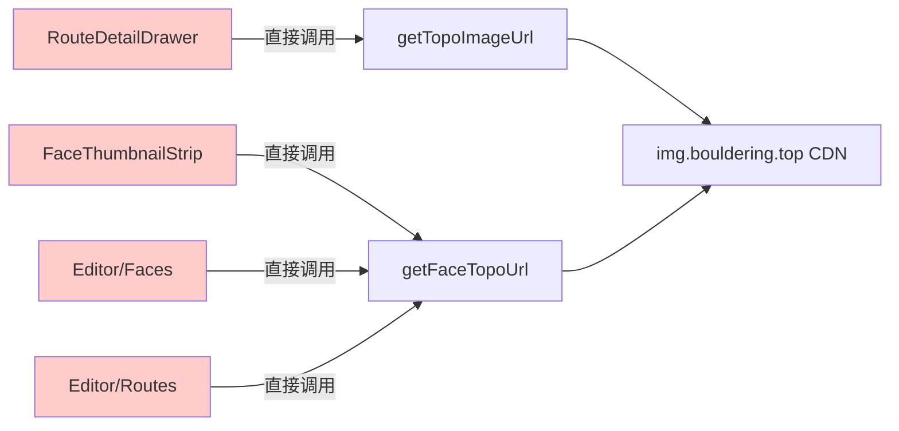

**具体问题：**

| 问题               | 举例                                                             |
| ------------------ | ---------------------------------------------------------------- |
| **重复的状态管理** | 每个组件都写一遍 `imageLoading`, `imageError`, `prevImageUrlRef` |
| **CRUD 后不刷新**  | 在 Editor 上传新图片后，切到线路详情页还是旧图                   |
| **组件间无法通信** | Editor 改了图片，FaceThumbnailStrip 不知道要刷新                 |
| **URL 散落各处**   | 4 个组件各自调用底层 URL 函数，没有统一管控点                    |

### 重构后的"统一入口"模式

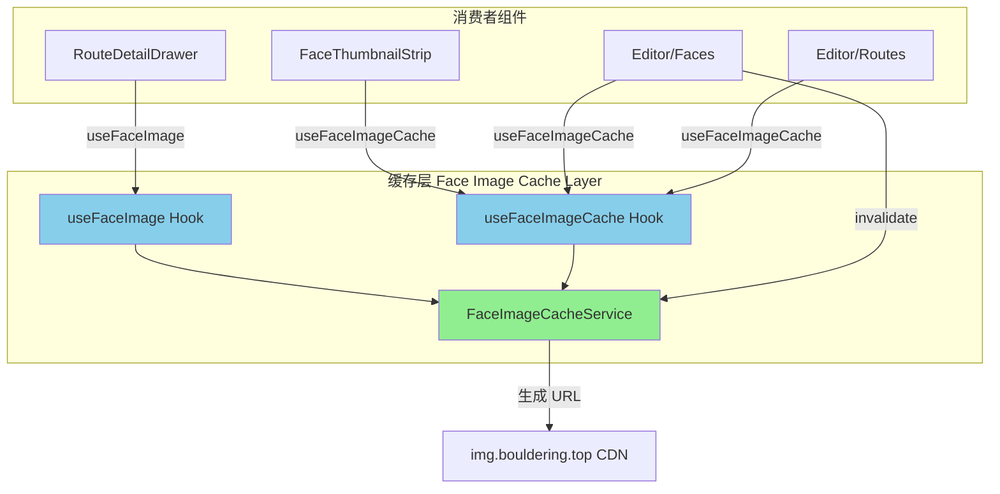

**所有岩面图片请求都经过 `FaceImageCacheService` 这个"中间人"。** 它负责：

1. 统一生成图片 URL
2. 管理版本号（让浏览器知道该刷新了）
3. 广播"图片已更新"的事件

---

## 2. 核心概念：什么是 Face Image？

在这个攀岩 App 里，"Face" (岩面) 就是一块岩壁的照片。线路 (Route) 绘制在岩面照片上：

```
岩场 (Crag)
├── 区域 A (Area)
│   ├── 岩面 1 (Face) ← 一张照片
│   │   ├── 线路 "月光" V3   ← 绘制在这张照片上
│   │   └── 线路 "星辰" V5   ← 也绘制在同一张照片上
│   └── 岩面 2 (Face)
│       └── 线路 "暗影" V7
└── 区域 B (Area)
    └── 岩面 3 (Face)
        └── 线路 "曙光" V2
```

### FaceKey: 图片的唯一标识

每张岩面图片用一个 **FaceKey** 来标识，格式是 `"岩场ID/区域/岩面ID"`：

```
"yuan-tong-si/左侧区域/face-1"
 └── cragId   └── area    └── faceId
```

这个 FaceKey 直接对应 R2 云存储中的路径（去掉 .jpg 后缀）：

```
R2 Key:  yuan-tong-si/左侧区域/face-1.jpg
FaceKey: yuan-tong-si/左侧区域/face-1
```

### 两种图片源

系统接受两种方式指定一张岩面图片：

```typescript
// 方式 1: Route 对象（最常见 — 从数据库查出来的线路）
const route: Route = {
  id: 1,
  cragId: "yuan-tong-si",
  name: "月光",
  area: "左侧区域",
  faceId: "face-1",
  grade: "V3",
};

// 方式 2: FaceImageSource 对象（缩略图场景 — 只知道哪个面，不关心线路）
const source: FaceImageSource = {
  cragId: "yuan-tong-si",
  area: "左侧区域",
  faceId: "face-1",
};
```

两种方式最终都映射到同一个 FaceKey。

---

## 3. 架构全景图

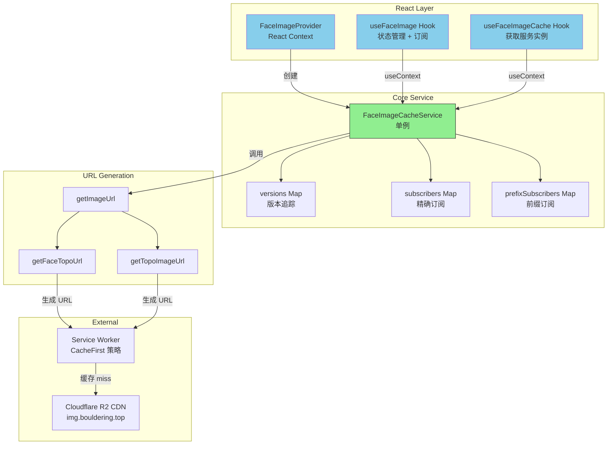

---

## 4. 核心模块拆解

### 4.1 类型定义 (`types.ts`)

这是整个缓存层的"词汇表"，定义了所有参与者说的"语言"：

```typescript
// FaceKey：一个字符串别名，代表岩面图片的唯一标识
type FaceKey = string; // 例: "yuan-tong-si/左侧区域/face-1"

// FaceImageSource：用三个字段描述一张岩面图片
interface FaceImageSource {
  cragId: string; // 岩场 ID
  area: string; // 区域名
  faceId: string; // 岩面 ID
}

// ImageSource：你可以用 Route 或 FaceImageSource 来指定图片
type ImageSource = Route | FaceImageSource;

// FaceImageStatus：图片加载的四种状态
type FaceImageStatus = "idle" | "loading" | "loaded" | "error";
//                      空闲     加载中      已加载     出错
```

### 4.2 缓存服务 (`cache-service.ts`)

这是**核心中的核心**。可以把它想象成一个"图片管理员"：

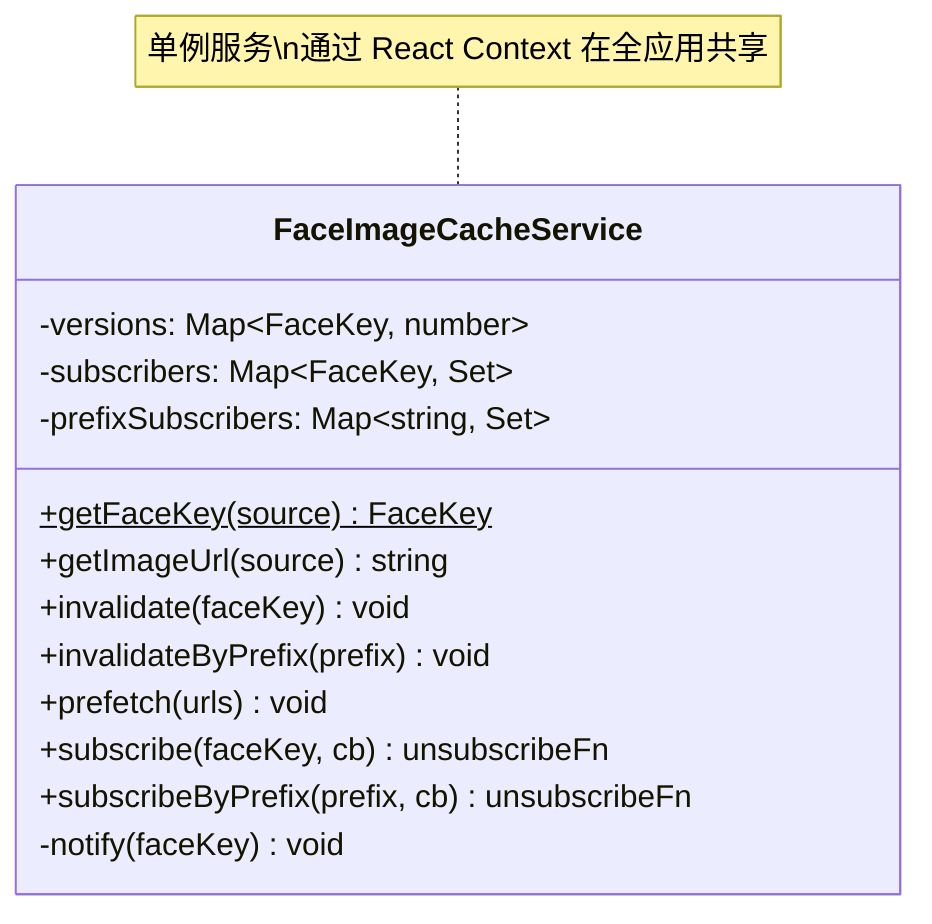

**三个内部 Map 的职责：**

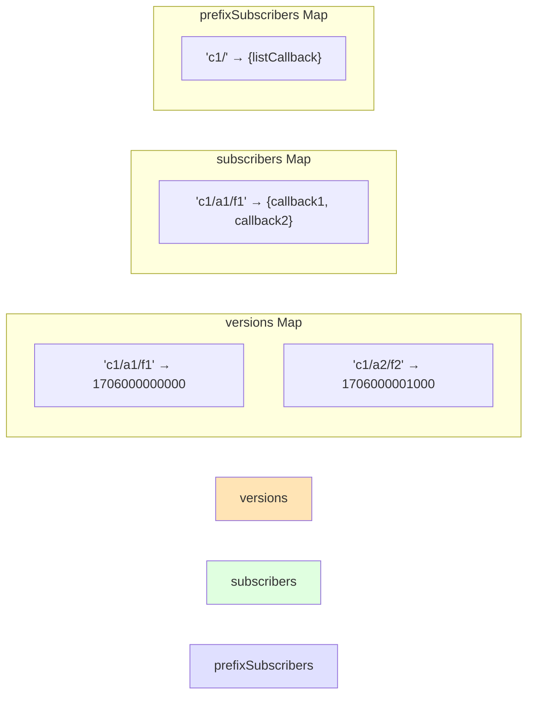

| Map                 | 存什么             | 谁写入                | 谁读取          |
| ------------------- | ------------------ | --------------------- | --------------- |
| `versions`          | FaceKey → 时间戳   | `invalidate()`        | `getImageUrl()` |
| `subscribers`       | FaceKey → 回调集合 | `subscribe()`         | `notify()`      |
| `prefixSubscribers` | 前缀 → 回调集合    | `subscribeByPrefix()` | `notify()`      |

### 4.3 React Hook (`use-face-image.ts`)

提供两个 Hook：

| Hook                   | 谁用                                  | 做什么                         |
| ---------------------- | ------------------------------------- | ------------------------------ |
| `useFaceImage(source)` | 需要显示图片的组件                    | 返回 URL + 加载状态 + 事件回调 |
| `useFaceImageCache()`  | 需要生成 URL 或调用 invalidate 的组件 | 返回 CacheService 实例         |

### 4.4 Context Provider (`face-image-provider.tsx`)

让所有组件共享同一个 `FaceImageCacheService` 实例：

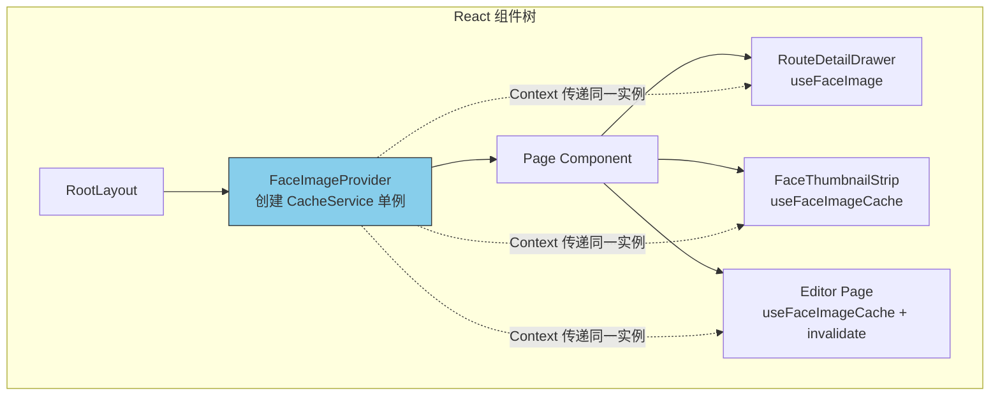

**为什么要用 Context？** 因为当 Editor 调用 `cache.invalidate()` 时，需要**同一个 cache 实例**上的 `subscribers` 才能收到通知。如果每个组件各自 `new FaceImageCacheService()`，它们的 Map 是独立的，事件传不过去。

---

## 5. 数据流详解

### 5.1 正常渲染流程

当用户打开一个线路详情页时：

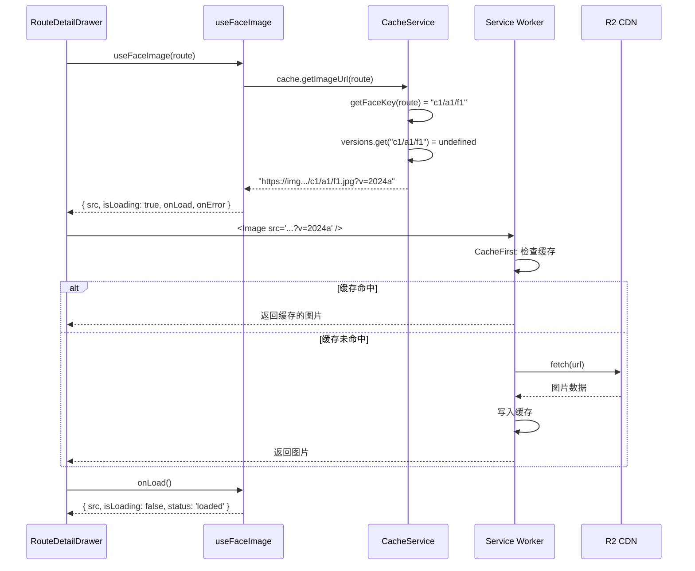

**关键点**: URL 中的 `?v=2024a` 是一个固定版本号（从 `constants.ts` 中的 `IMAGE_VERSION` 来），浏览器和 SW 会认为这是同一个资源，可以从缓存中返回。

### 5.2 CRUD 后的缓存失效流程

当 Editor 上传了一张新的岩面图片时：

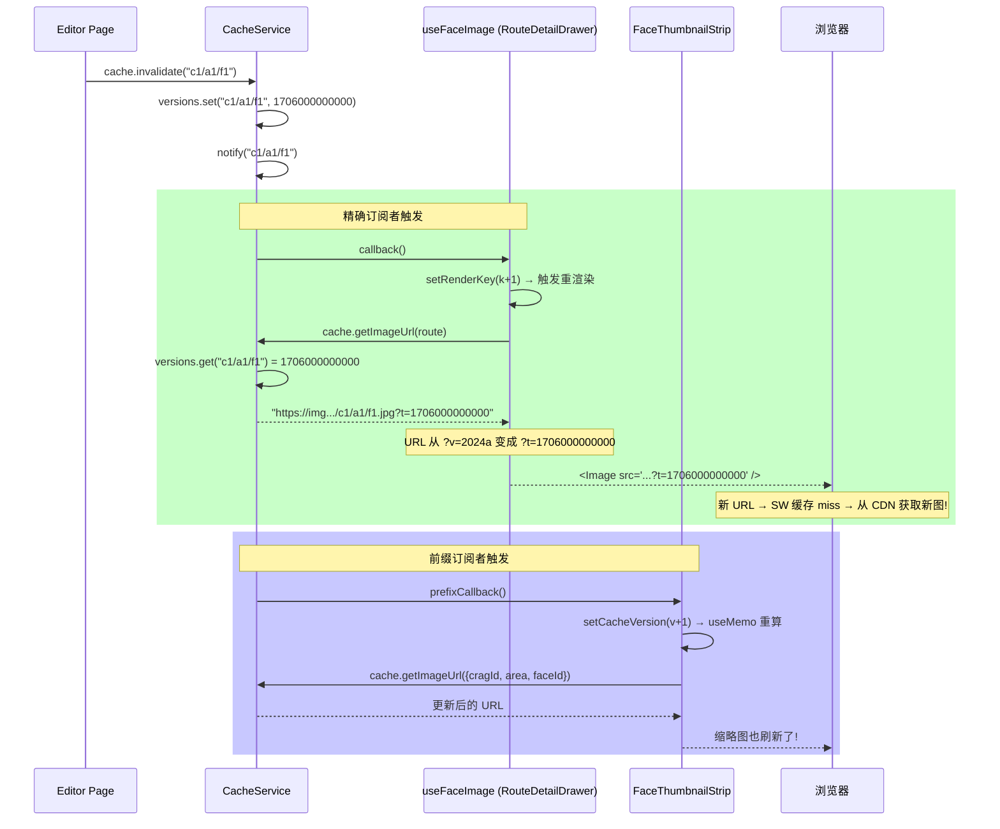

**核心技巧**: 只改 URL 的查询参数（从 `?v=` 变为 `?t=时间戳`），浏览器和 SW 就认为是"新资源"，自动去网络获取。这叫 **Cache Busting（缓存爆破）**。

---

## 6. 关键设计决策与权衡

### 决策 1: URL 版本化 vs Blob URL

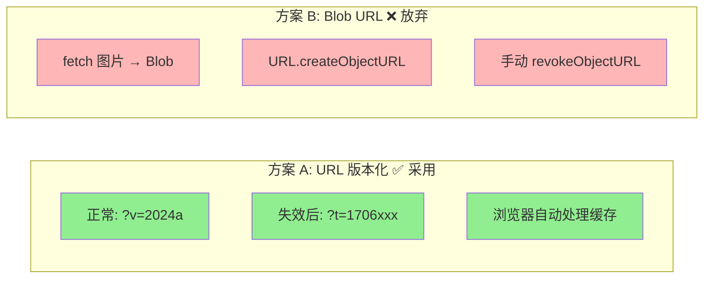

|                            | URL 版本化  | Blob URL                    |
| -------------------------- | ----------- | --------------------------- |
| **Next.js `<Image>` 兼容** | ✅ 正常工作 | ❌ 不通过 `remotePatterns`  |
| **内存管理**               | ✅ 无需管理 | ⚠️ 需手动 `revokeObjectURL` |
| **与 SW 协同**             | ✅ 天然兼容 | ❌ 绕过 SW 缓存             |
| **代码复杂度**             | 简单        | 复杂                        |

### 决策 2: 非 null Context 默认值

```typescript
// ❌ 之前: 需要到处判空
const cache = useFaceImageCache() // 可能是 null
const url = cache ? cache.getImageUrl(source) : getFaceTopoUrl(...)
//          ^^^^^ 每个消费者都要写这个判空逻辑

// ✅ 现在: 始终可用
const cache = useFaceImageCache() // 一定不是 null
const url = cache.getImageUrl(source)
//          直接用，不用判空
```

**怎么做到的？** Context 的默认值设成了一个真实的 `new FaceImageCacheService()` 实例，而不是 `null`。即使没有 Provider 包裹（理论上不会发生），也能正常工作。

### 决策 3: 两种订阅模式

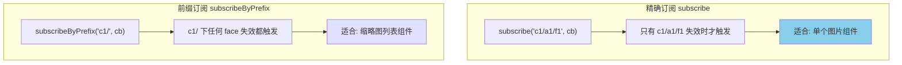

**为什么需要两种？**

- `RouteDetailDrawer` 只关心**当前正在看的那张图**→ 精确订阅
- `FaceThumbnailStrip` 显示某岩场下**所有**缩略图 → 前缀订阅

如果缩略图也用精确订阅，它需要订阅每一个 face（可能几十个），而且当列表变化时还要管理订阅/取消订阅。前缀订阅一行代码搞定。

---

## 7. 代码走读：从请求到渲染

### 步骤 1: Provider 注入 (layout.tsx)

```tsx
// src/app/[locale]/layout.tsx
import { FaceImageProvider } from "@/components/face-image-provider";

export default function RootLayout({ children }) {
  return (
    <html>
      <body>
        {/* 其他 Provider */}
        <FaceImageProvider>
          {" "}
          {/* ← 这里注入 */}
          {children}
        </FaceImageProvider>
      </body>
    </html>
  );
}
```

`FaceImageProvider` 用 `useMemo` 创建一个 `FaceImageCacheService` 实例，通过 React Context 传给所有子组件。因为 `useMemo(() => new ..., [])` 的空依赖数组，整个应用生命周期只会创建**一次**。

### 步骤 2: 组件消费 (route-detail-drawer.tsx)

```tsx
// 重构前: 手动管理 5 个状态
const [imageLoading, setImageLoading] = useState(true)
const [imageError, setImageError] = useState(false)
const prevImageUrlRef = useRef<string | null>(null)
// ... 还有 useEffect 来重置状态

// 重构后: 一行搞定
const {
  src: topoImageUrl,      // 图片 URL (带版本号)
  isLoading: imageLoading, // 是否加载中
  isError: imageError,     // 是否出错
  onLoad: handleImageLoad, // <Image> 的 onLoad 回调
  onError: handleImageError // <Image> 的 onError 回调
} = useFaceImage(route)

// 使用方式完全不变:
<Image
  src={topoImageUrl!}
  onLoad={handleImageLoad}
  onError={handleImageError}
/>
```

### 步骤 3: Editor CRUD 后失效 (editor/faces/page.tsx)

```tsx
const cache = useFaceImageCache();

// 上传新图片后:
async function handleUpload(file, cragId, area, faceId) {
  await fetch("/api/upload", {
    /* ... */
  });
  // ↓ 关键：通知缓存层"这张图片变了"
  cache.invalidate(`${cragId}/${area}/${faceId}`);
}

// 删除图片后:
async function handleDelete(cragId, area, faceId) {
  await fetch("/api/faces", { method: "DELETE" /* ... */ });
  cache.invalidate(`${cragId}/${area}/${faceId}`);
}

// 重命名后 (区域名变了):
async function handleRename(cragId, oldArea, newArea, faceId) {
  await fetch("/api/faces/rename", {
    /* ... */
  });
  cache.invalidate(`${cragId}/${oldArea}/${faceId}`);
  cache.invalidate(`${cragId}/${newArea}/${faceId}`);
}
```

---

## 8. 事件订阅系统详解

这是整个缓存层最精妙的部分。它解决了 React 中的一个经典问题：**一个组件的操作，如何通知其他组件？**

### notify() 的工作原理

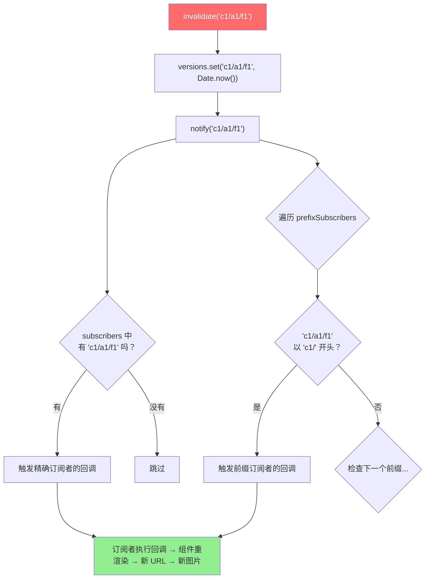

### 订阅 & 取消订阅

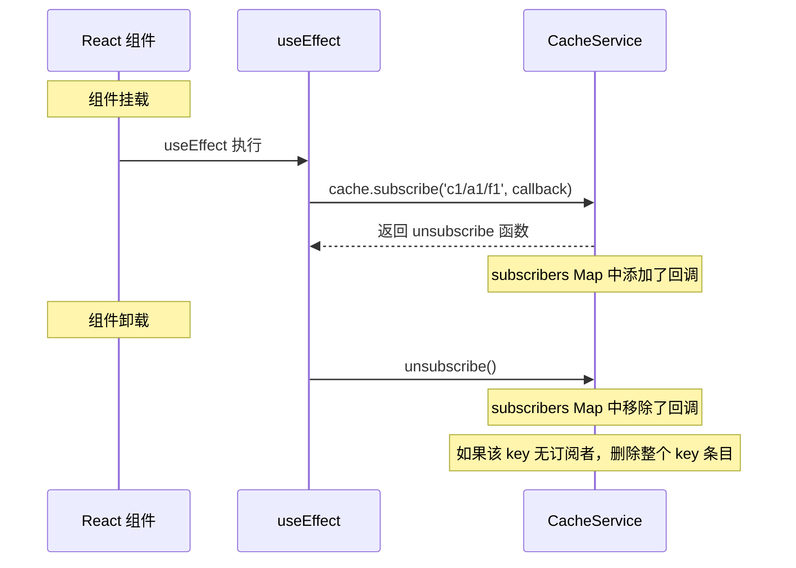

**为什么要取消订阅？** 防止内存泄漏。如果组件卸载后 callback 还在 Map 中，每次 `invalidate` 都会调用一个指向已卸载组件的函数，这就是"内存泄漏"。React 的 `useEffect` 清理函数完美解决了这个问题。

---

## 9. 文件地图

```
src/
├── lib/face-image-cache/          # 核心缓存模块
│   ├── types.ts                   # 📋 类型定义 (FaceKey, ImageSource, ...)
│   ├── cache-service.ts           # 🧠 核心服务 (版本管理 + 事件订阅)
│   ├── cache-service.test.ts      # 🧪 24 个单元测试
│   └── index.ts                   # 📦 公共导出
│
├── hooks/
│   └── use-face-image.ts          # 🪝 React Hooks (useFaceImage + useFaceImageCache)
│
├── components/
│   ├── face-image-provider.tsx    # 🏗️ React Context Provider
│   ├── route-detail-drawer.tsx    # 👁️ 消费者: 线路详情大图
│   └── face-thumbnail-strip.tsx   # 👁️ 消费者: 缩略图条
│
└── app/[locale]/
    ├── layout.tsx                 # 🔌 Provider 注入点
    └── editor/
        ├── faces/page.tsx         # ✏️ 生产者: 上传/删除/重命名
        └── routes/page.tsx        # 📍 消费者: URL 生成
```

### 依赖关系

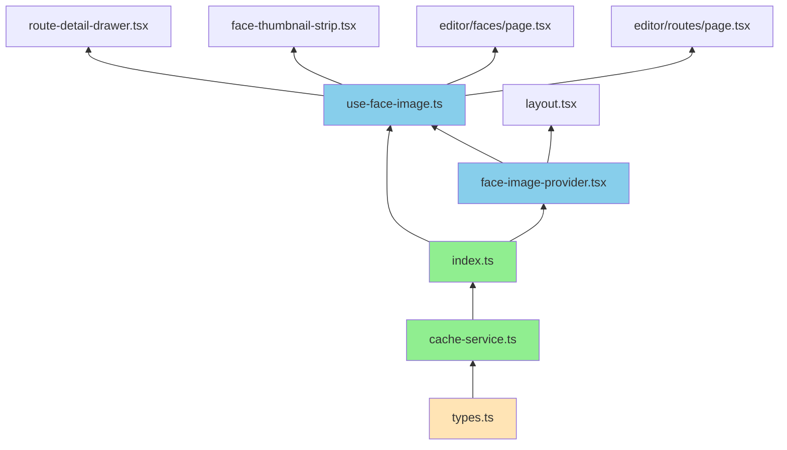

---

## 10. 常见问题 FAQ

### Q: 为什么不用 React Query / SWR？

这个项目的图片不是通过 API 返回的 JSON 数据——它们是**直接渲染在 `` 标签的 src 中的 URL**。React Query 管理的是"异步数据获取"，而我们需要管理的是"URL 版本号 + 事件通知"。两者解决的问题不同。

### Q: `?v=2024a` 和 `?t=1706000000000` 有什么区别？

- `?v=2024a` — 静态版本号，写在代码里，部署时更新。浏览器/SW 会缓存这个 URL。
- `?t=1706000000000` — 动态时间戳，CRUD 操作后生成。因为每次时间戳不同，浏览器认为是新 URL，强制重新获取。

### Q: `versions` Map 会不会无限增长？

理论上会，但实际中：

- 每个 Map 条目只存一个字符串 key + 一个数字 value（~100 bytes）
- 一个岩场通常只有 5-20 个 face
- 用户一次浏览不会看超过 100 个不同的 face
- 页面刷新后 Map 清空（它只在内存中，不持久化）

所以最多占用几 KB，完全不是问题。

### Q: FaceThumbnail 组件为什么不用 useFaceImage Hook？

`FaceThumbnail` 是一个**纯展示组件**——它只接收 `src` prop 渲染 ``。它不需要知道缓存层的存在。URL 的生成和失效由它的父组件 `FaceThumbnailStrip` 通过 `useFaceImageCache` 处理。

这体现了一个设计原则：**关注点分离 (Separation of Concerns)**。

### Q: 如果两个组件同时 invalidate 同一个 key 会怎样？

完全安全。`invalidate` 只是：

1. 在 Map 中设置一个时间戳（后调用的会覆盖前面的）
2. 通知订阅者

即使并发调用，最终 Map 中只有一个值，订阅者收到两次通知，组件渲染两次（React 会自动批量处理，实际可能合并为一次渲染）。

---

_文档生成时间: 2026-02-04_
_基于 Face Image Cache Layer 实现代码_
